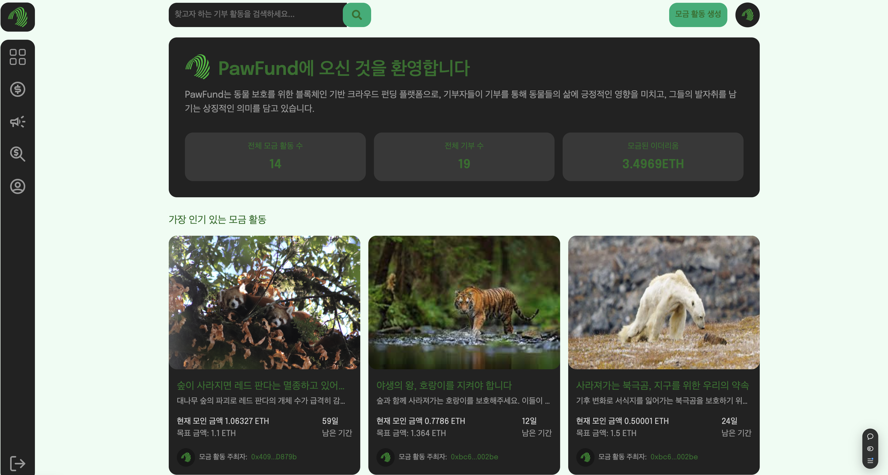

# PawFund

PawFund는 동물 보호를 위한 블록체인 기반 크라우드 펀딩 플랫폼으로,
기부자들이 기부를 통해 동물들의 삶에 긍정적인 영향을 미치고,
그들의 발자취를 남기는 상징적인 의미를 담고 있습니다.



## Node Version

- v20.5.0

---

먼저, 저장소를 클론한 뒤 의존성을 설치해야 합니다.

```shell

git clone https://github.com/ahmedsemih/CrowdFunding-dApp.git
cd client
npm install
cd ..
cd smart-contract
npm install

```

이 작업을 완료한 후, Alchemy에서 프로젝트를 생성해야 합니다. 그런 다음 아래의 환경 변수를 설정하세요.

```shell

--- CLIENT ---
NEXT_PUBLIC_API_BASE_URL - API url like: http://localhost:3000/api (You must change it when deploying on production)
NEXT_PUBLIC_PROVIDER_URL - Alchemy url with your API key
NEXT_PUBLIC_CONTRACT_ADDRESS - Address of your contract ( You will get this after deploy your contract )
NEXT_PUBLIC_PRIVATE_KEY - Metamask private key

--- SMART CONTRACT ---
ACCOUNT_PRIVATE_KEY - Metamask private key
PROJECT_ID - Alchemy API key

```

그리고 스마트 컨트랙트를 배포한 뒤 클라이언트를 실행하세요.

```shell

--- SMART CONTRACT Deploy ---
npx hardhat ignition deploy ./ignition/modules/CrowdFunding.js --network sepolia

--- SMART CONTRACT Test ---
npx hardhat test

--- CLIENT ---
npm run dev

```

## Vercel에서 배포하기

1. **Vercel 대시보드에 로그인합니다.**
2. **"New Project"** 버튼 클릭.
3. GitHub, GitLab, Bitbucket 계정을 연결하고 배포할 저장소를 선택합니다.
4. **프로젝트 설정**:
   - **Build Command**: 기본적으로 `next build`가 설정됩니다.
   - **Output Directory**: 기본값인 `/client`를 사용합니다.
5. **"Deploy"** 버튼 클릭.

---

## 환경 변수 설정 (필요 시)

1. Vercel 프로젝트 설정 페이지로 이동합니다.
2. **"Settings" > "Environment Variables"** 클릭.
3. 필요한 환경 변수를 추가합니다.
   - `NEXT_PUBLIC_API_BASE_URL`
   - `NEXT_PUBLIC_PRIVATE_KEY`
   - `NEXT_PUBLIC_PROVIDER_URL`
   - `NEXT_PUBLIC_CONTRACT_ADDRESS`
4. 변경 사항 저장 후 다시 재배포 실행됩니다.
